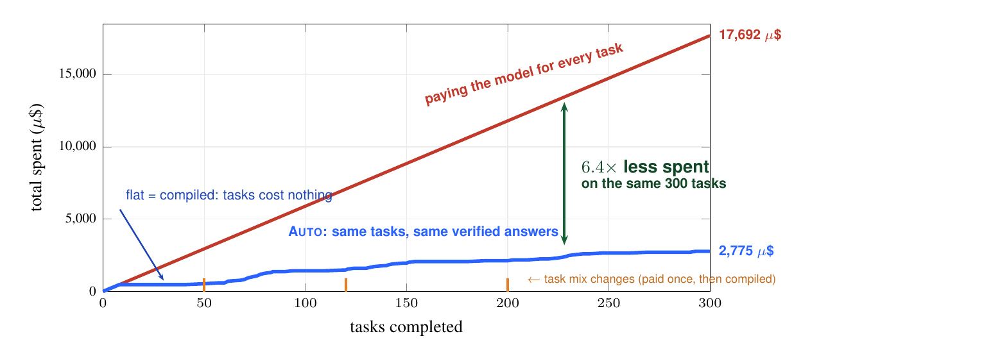

# Auto

**Paper:** [arXiv:2607.04542](https://arxiv.org/abs/2607.04542) · **Built by** [RightNow AI](https://www.rightnowai.co) · Apache-2.0

Auto compiles recorded LLM-agent behavior into verified, capability-confined
wasm binaries, with a tiered runtime that falls back to a frontier model for
novelty and recompiles the result. It records what an agent does, proves which
parts are secretly symbolic, extracts those, distills the rest into small
specialists, verifies the whole against a behavioral contract, and emits a
cognition binary (`.cbin`): code plus small models plus a measured manifest.



The idea in one line: treat the frontier model as an interpreter, and build
the compiler that has always followed interpreters. The plain-language story,
with every measured number and its provenance, is in
[docs/why-agi-compiler.md](docs/why-agi-compiler.md).

`CLAUDE.md` records the engineering norms we held ourselves to while building
this; `spec/` is written for external readers.

## what it is

- The compiler: `auto record` attaches to a live agent and captures traces,
  `auto compile --contract` lowers them to a typed IR, runs the passes, and
  verifies against the contract before emitting a `.cbin`.
- The runtime: tier-1 is the compiled fast path. tier-0 is a frontier model as
  interpreter, for inputs the guard flags as novel. A guard trip deopts to
  tier-0, captures the trace, and recompiles. This is the ratchet: nothing is
  figured out twice.
- The artifact: content-addressed `.cbin` with a manifest that reports eval
  scores, cost and latency bounds, capability requirements, and provenance.
  The manifest reports measured numbers or `null`, never aspirational ones.

Capability confinement is physical: emitted artifacts declare zero wasm
imports and the loader refuses anything else, so a binary cannot exceed its
declared effects.

## measured results

Every number below is traceable to `paper/bench-results.md` (which carries the
eval-run ids and ledger lines) or `paper/claims.md`.

- Determinism census: 488 of 560 recorded effectful spans were
  witnessed-deterministic (87.1% pooled), with three families at 100.0% and
  free-text generation as the residue. This is the measured form of the claim
  that most agent cognition is secretly symbolic.
- The ratchet, on a 300-item novelty stream with three scheduled distribution
  shifts (positions 50, 120, 200): marginal cost per item fell from about
  59 µ$ (pure frontier) to 2 µ$/item steady-state, 6.4x cheaper end-to-end,
  with three recompile generations each landing one cycle behind a shift, zero
  errors, and every recompile passing the same contract gate. Tier-1 answers
  matched the reference agent on witnessed inputs 124 of 128 times (96.9%).
- Latency ladder on the compiled path: 736 ms (frontier) to about 21 ms (serve
  over HTTP) to 290 µs (stdio) to 54.1 µs (in-process python, pyo3) to 18.2 µs
  (in-process node, napi). The in-process figures measure the call boundary on
  trivial fixtures, not inference.

The same stream run at a deliberately loose guard measured the failure mode the
architecture exists to prevent: 48.9% of tier-1 answers silently wrong.
Calibration, not model capability, decides whether cheap stays correct.

## pipeline

```
  frontend            IR                 passes                 backend
  --------            --                 ------                 -------
  trace SDK   -->  typed task graph  --> extract  --> verify --> task.cbin
  (prompts,        (capability and       distill      (contract   (wasm code
   tool calls,      memory effects,      optimize      gate)        + small models
   args, results)   uncertainty,                                    + manifest)
                    resource bounds)

  run:  input --> guard --> in-distribution --> tier-1 (compiled, guarded)
                        \-> novel --> deopt --> tier-0 (frontier) --> capture
                                                        \-> recompile --> tier-1
                            (the ratchet: nothing figured out twice)
```

The passes, in order: symbolic extraction (enumerative search or LLM-guided
CEGIS, candidates checked in a wasmtime sandbox with no network), distillation
(residual fuzzy nodes into small tree or MLP specialists), verification (the
contract is the type checker; differential testing against the reference model;
a failing or unmeasurable contract blocks emit), and optimization. Guards use
trigram-Jaccard distance with split-conformal calibration for calibrated
abstention.

## build

Requirements:

- rust 1.96.1 (edition 2024), pinned in `rust-toolchain.toml`.
- `flatc` 25.12.19 exactly. It must match the pinned `flatbuffers` crate; the
  IR build fails on a mismatch.

`crates/auto-ir/build.rs` resolves `flatc` in this order: the `FLATC` env var,
then `tools/flatc/flatc[.exe]` (gitignored), then `PATH`. Install it from the
official release, for example on Windows extract `flatc.exe` from
`Windows.flatc.binary.zip` at
`github.com/google/flatbuffers/releases/download/v25.12.19/` into
`tools/flatc/`. Linux uses `Linux.flatc.binary.clang++-18.zip` from the same
release.

The gates CI runs on every pull request:

```
cargo fmt --all --check
cargo clippy --workspace --all-targets -- -D warnings
cargo test --workspace
```

## quickstart

Build the CLI, then run the end-to-end script. It records the toy agent through
the real python SDK, checks the measured determinism report, compiles a `.cbin`
through the verification gate, runs it, and proves the negative paths: a wrong
implementation is blocked, a far input abstains, a deopt is ingested and
recompiled to tier-1, and a tampered registry artifact is refused.

```
cargo build -p auto-cli
bash evals/toy-agent/e2e.sh
```

The same steps by hand, one task, record to run:

```
# record the toy agent twice, then read the measured determinism report
cargo run -p auto-cli -- record --store store.db -- python evals/toy-agent/agent.py
cargo run -p auto-cli -- record --store store.db -- python evals/toy-agent/agent.py
cargo run -p auto-cli -- report --task toy-agent --store store.db

# verify a contract against the recorded spans (writes a content-addressed eval run)
cargo run -p auto-cli -- verify --contract evals/toy-agent/fake-frontier.contract.toml --store store.db

# compile the span into a .cbin; without --module the implementation is
# synthesized from the recorded observations, and emit is verification-gated
cargo run -p auto-cli -- compile --contract evals/toy-agent/fake-frontier.contract.toml --store store.db --out fake-frontier.cbin

# run the compiled artifact
cargo run -p auto-cli -- run --artifact fake-frontier.cbin \
  --input '{"prompt":"The quick brown fox jumps over the lazy dog near the riverbank."}'

# inspect the artifact and its manifest
cargo run -p auto-cli -- inspect fake-frontier.cbin
```

The paid paths (LLM-guided CEGIS at `--synth llm`, and a frontier model as
tier-0 via `--tier0 "frontier:<model-id>"`) are fail-closed: they need
`OPENAI_API_KEY` and an explicit nonzero `--spend-cap-usd`. The default cap of 0
refuses every paid call, and every call is appended to `~/.auto/spend.jsonl`.

## benchmark

AUTO-BENCH v1 asks the question the thesis lives on: does the system ever pay
for the same thought twice? The protocol is frozen before execution in
`evals/bench/DESIGN.md`. The measured results, with every number carrying an
eval-run id or a ledger line and a failures-and-refusals section at equal
weight, are in `paper/bench-results.md`; per-position stream data is under
`paper/evidence/`.

Reproduction: `evals/bench/README.md` has one leg per task family. Paid loops
are gated behind `RECORD=1` or `JUDGE=1` with the spend cap passed as an
argument. A stranger with an OpenAI key reproduces every table for well under
$1. Total ledgered benchmark spend was $0.0621 of a pre-registered $5.00 cap.

## layout

| path | what |
|---|---|
| `crates/auto-ir` | typed task graph: effects, uncertainty, resource bounds; flatbuffers serialization with byte-stable round-trip |
| `crates/auto-trace` | trace model, strict JSONL ingestion, sqlite store, determinism report, replay comparison |
| `crates/auto-contract` | contract format, verification harness with three-valued verdicts, content-addressed eval runs |
| `crates/auto-passes` | symbolic extraction (enumerative search or LLM-guided CEGIS), region synthesis, tree and MLP distillation drivers |
| `crates/auto-dsl` | the closed extraction DSL: one evaluator, compiled natively for search and to wasm for artifacts |
| `crates/auto-model` | distilled-model wire format and tree inference over frozen char-trigram features |
| `crates/auto-backend` | `.cbin` container (content-addressed), honest manifest, differential checks, verification-gated emit |
| `crates/auto-runtime` | tier-1 wasm execution (zero-import capability refusal, fuel and memory limits), conformal guards, deopt, recompile ingestion |
| `crates/auto-frontier` | the only paid-API path: spend-capped client, pinned price table, append-only ledger |
| `crates/auto-registry` | local content-addressed artifact store and detached ed25519 signing |
| `crates/auto-serve` | `auto serve`: registry artifacts over HTTP, guard-gated tier-1 per request, 409 abstention on a trip |
| `crates/auto-proxy` | `auto proxy`: record any OpenAI-backed agent with zero code changes |
| `crates/auto-daemon` | `auto daemon`: the ratchet as a service; watch a store, recompile on new evidence, publish |
| `crates/auto-cli` | `record`, `report`, `verify`, `compile`, `distill`, `run`, `registry`, `inspect`, `serve`, `proxy`, `daemon` |
| `crates/auto-py` | in-process python embedding (pyo3, abi3 wheel) |
| `crates/auto-node` | in-process node embedding (napi addon) |
| `sdk/python`, `sdk/typescript` | recording and replay tracers, same wire format |
| `spec/` | `ir.md` and the dialect specs; `adr/` for irreversible decisions |
| `evals/` | reference tasks, e2e scripts, and the benchmark under `evals/bench` |

## honest limitations

The benchmark corpora are designed: realistic but synthetic. The production
claim is an operator rerun on their own recorded traffic, not this corpus. The
determinism and parity numbers are measured on those tasks at benchmark scale
(560 spans), not a capability eval of the underlying model, which is the
reference interpreter and not the subject. Free-text generative behavior is the
honest residue: at 40 tickets the summarize family does not compile to a tree
at its declared judged threshold and stays tier-0, and field-extraction is a
fully deterministic behavior the v0 output algebra cannot yet compile, an honest
refusal at all three rungs. Guards are lexical (Jaccard and cosine); they
calibrate real vocabularies well but admit lexical cousins, and a loose guard on
the novelty stream produced 48.9% silently wrong tier-1 answers. Semantic
embedding guards and sigstore signing are recorded targets, not claims; current
signing uses a single local ed25519 keypair, and recorded cost and token
attributes are the agent's own declaration.

## license

Apache-2.0. Copyright 2026 RightNow AI. See `LICENSE`.

## citation

"Auto: The AGI Compiler", Jaber Jaber and Osama Jaber, arXiv:2607.04542.
Paper: https://arxiv.org/abs/2607.04542

```bibtex
@misc{jaber2026auto,
  title         = {Auto: The AGI Compiler},
  author        = {Jaber, Jaber and Jaber, Osama},
  year          = {2026},
  eprint        = {2607.04542},
  archivePrefix = {arXiv},
  primaryClass  = {cs.LG},
  url           = {https://arxiv.org/abs/2607.04542}
}
```
