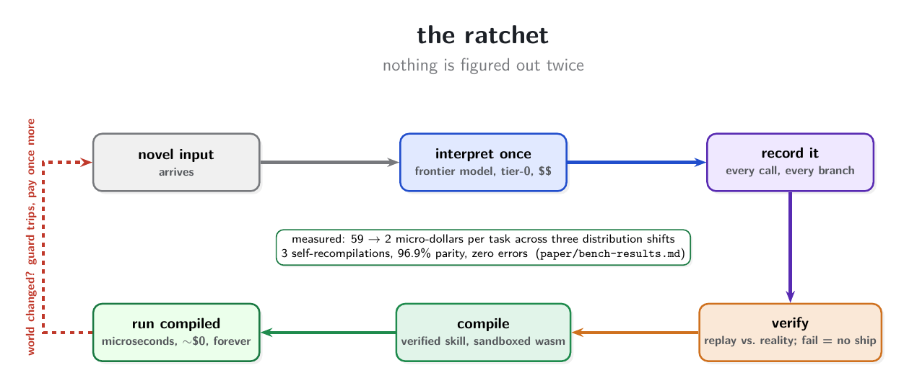
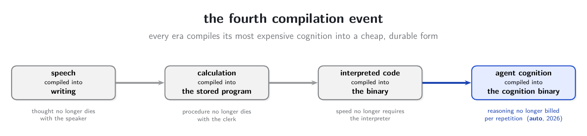

# why "the agi compiler"

This page explains the idea behind auto in plain language, why it carries the
name it does, and exactly which parts of the story are measured versus argued.
The paper ("Auto: The AGI Compiler") is the precise version; this is the
readable one.

## the problem, stated plainly

An LLM agent that triages support tickets makes the same routing decision
thousands of times a day, and pays a frontier model to re-derive it from
scratch every single time. We measured the price of that habit directly: a
single-call routing agent costs a mean of 55.6 micro-dollars and a median of
904 ms per decision; a three-call pipeline costs 192.5 micro-dollars and 2.9
seconds per run. At production volume this is the biggest line item in agent
deployment, and it buys nothing new. The model computes an answer it already
computed yesterday, with no guarantee it computes the same one.

Humans do not work this way. When you learn to drive, the first hours consume
your full attention; a year later your hands do it while you talk. Psychology
calls this proceduralization: expensive, deliberate cognition gets converted
into cheap, automatic skill. Today's agents never proceduralize anything. They
stay permanently in the first hour of driving, at full price, forever.

## the idea

Treat the frontier model as an interpreter and build the compiler that has
always followed interpreters.

- **interpret once.** A novel input arrives. The frontier model handles it,
  expensively. That is tier-0, and it is the right tool for genuine novelty.
- **record it.** Drop-in SDK shims capture every effectful step of the run:
  model calls, tool calls, branch decisions, inputs, outputs, latencies,
  provider-reported cost.
- **measure what repeats.** A determinism census counts, span by span, how
  much of the recorded behavior is actually a fixed rule wearing a model
  costume. This number is the whole thesis, so it is measured before anything
  is compiled: across 560 recorded spans of real gpt-5.4-mini agents, 87.1%
  were witnessed-deterministic. Three of the four censused task families measured 100.0%.
- **compile the deterministic parts.** Program synthesis (enumerative search
  plus LLM-proposed candidates checked against counterexamples) extracts the
  parts that are secretly parsers and routers; small distilled models take the
  fuzzy residue.
- **verify or refuse.** Nothing ships on optimism. Every candidate must replay
  the recorded reality it claims to reproduce, at thresholds the contract
  declared before compilation. A candidate that fails, or that cannot be
  measured, is refused. The refusals are reported with the same weight as the
  wins; in our benchmark, field extraction refused at all three compile rungs
  and free-text summarization refused at 40-ticket scale, and both refusals
  are in the results tables.
- **run compiled, guarded.** The verified artifact is a sandboxed WebAssembly
  binary. Pure behavior compiles to a module with zero imports; a tool-using
  behavior imports exactly one audited host function. The sandbox, not a
  policy file, is what makes an artifact unable to exceed its declared
  capabilities. A conformally calibrated guard sits in front of every call:
  inputs that look like the witnessed distribution run compiled in
  microseconds at roughly zero marginal cost; anything else abstains.
- **when the world changes, pay once more.** A guard trip falls back to the
  reference agent, the new behavior is recorded, and the next compile folds it
  in. That loop is the ratchet. Nothing is figured out twice.

## why the name

Every era compiles its most expensive cognition into a cheap durable form.
Writing compiled speech, so thought stopped dying with the speaker. The stored
program compiled calculation, so procedure stopped dying with the clerk. The
binary compiled interpreted code, so speed stopped requiring the interpreter
at runtime. Agent cognition is the next thing sitting in interpreted form, and
the cognition binary is its compiled form.

The name makes one narrow, testable claim, stated in the paper's abstract: an
"AGI compiler" here means a system that autonomously converts novel experience
into permanent, verified, near-free skill while measuring what it does not
know. Whatever artificial general intelligence turns out to be, it cannot be a
system that pays full price to re-derive the same thought twice; it needs
exactly this ratchet. The name means "the compiler that agi-class systems will
need," not "we built agi." Everything after that sentence in the paper is
receipts.

## what is actually measured

All numbers below come from AUTO-BENCH, a benchmark whose protocol was frozen
before execution (evals/bench/DESIGN.md). Every number carries an
evaluation-run id, a spend-ledger session, or a committed CSV under
paper/evidence/. Reproducing the entire benchmark costs under a dollar of API
spend.

- **the census.** 87.1% of 560 recorded frontier-agent spans were
  witnessed-deterministic (observed at least twice, byte-identical, no
  errors). Classification, extraction, and routing measured 100.0%; free-text
  summarization measured 17.5% and is honestly the residue.
- **the ratchet, closed live.** A 300-item stream with three scheduled
  distribution shifts. The system started uncompiled, compiled generation 1
  after 8 items, and recompiled twice more, generations 2 and 3 landing one
  compile cycle behind the first two shifts. The third shift was absorbed by
  the guard admitting lexically similar tickets rather than by a recompile,
  which is exactly the calibration exposure the benchmark also measures. Marginal cost fell from 59 to about 2
  micro-dollars per item; the full stream cost 2,775 micro-dollars against a
  17,692 pure-frontier control (6.4x); 253 of 300 items ran compiled; zero
  errors; 96.9% parity with the reference agent on witnessed inputs.
- **the failure modes, quantified.** The same stream run with a loose guard
  looked operationally perfect while silently mislabeling 48.9% of its
  compiled answers. Run with a generic fallback model instead of the agent
  itself, the verification gate refused the recompilations rather than compile
  a non-conformant reference. Calibration and reference fidelity, not model
  capability, decide whether cheap stays correct. This is the finding we
  consider most important, and it is why verification is the product.
- **the latency ladder.** The same compiled skill was measured at every
  serving boundary: 736 ms as a frontier call, about 21 ms behind an HTTP
  server, 290 microseconds as a resident process, 54.1 microseconds embedded
  in Python, 18.2 microseconds embedded in Node.

## what this is not

- It is not a cache. A cache replays stored answers to repeated queries; auto
  compiles the function, executes fresh inputs it was never asked verbatim,
  proves parity against recorded behavior, refuses outside its calibration,
  and physically cannot exceed its declared capabilities.
- It is not a claim that agents are unnecessary. The frontier model remains
  the interpreter for genuine novelty, and the whole design assumes it stays
  in the loop at tier-0.
- It is not a claim of generalization beyond witnessed behavior. Compiled
  artifacts reproduce what was recorded and verified; the guard exists
  precisely to refuse what was not. The benchmark measures the boundary
  instead of hiding it.
- It is not production-scale evidence yet. The corpora are designed, 20 to 40
  recorded inputs per family (the stream holds 56 distinct texts), one
  reference model. The protocol is built to be
  re-run unchanged on real traffic, and that re-run is the experiment that
  matters next.

## where to look

- the paper: "Auto: The AGI Compiler" (arXiv id pending; citation stub in the README)
- the frozen benchmark protocol: evals/bench/DESIGN.md
- the full results with provenance: paper/bench-results.md and paper/evidence/
- the claims ledger, every claim tagged measured-or-pending: paper/claims.md
- the day-by-day experiment log, failures included: paper/log.md
